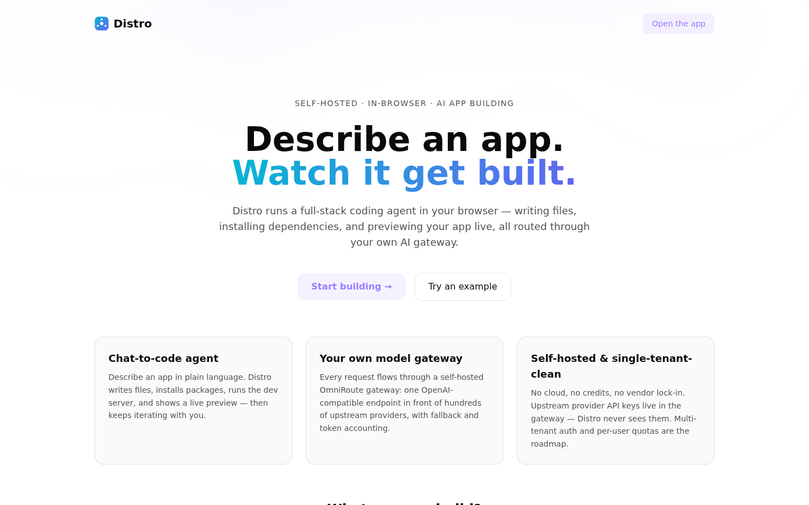
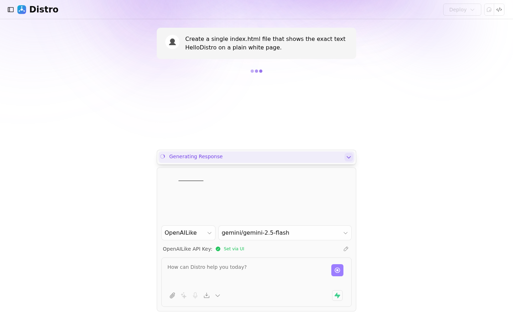
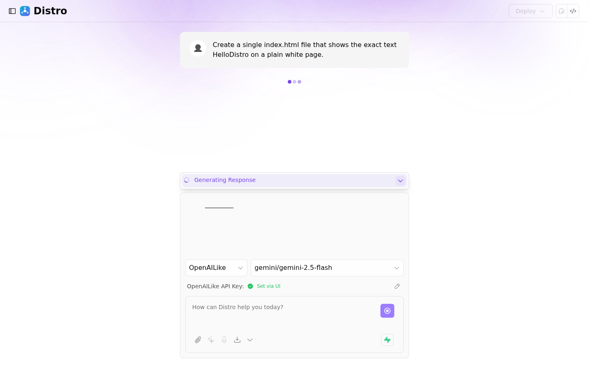

<div align="center">

# Distro

**Self-hosted AI app-building platform — BuilderOps.**

Describe an application in natural language and Distro's AI agent writes, runs,
previews, and iterates on a full-stack codebase in your browser — no local dev
environment required.

[](https://github.com/innotelinc/distro/actions/workflows/ci.yml)
[](https://github.com/innotelinc/distro/actions/workflows/conform.yml)
[](LICENSE)

</div>

> **About Distro** — a self-hosted AI app-building platform that assembles two
> MIT-licensed open-source projects and operates them as one service: bolt.diy
> (in-browser IDE) + OmniRoute (AI routing gateway). Distro's agent only ever talks
> to OmniRoute, and OmniRoute is the only place upstream provider keys live. Distro
> runs its own OmniRoute gateway in its compose stack and shares the upstream provider
> pool with Atlas Chef. Identity (optional) and billing come from the Innotel
> Platform Stack — Cerulean Authentik and Magnate. **Landing page:**
> [innotelinc.github.io/distro](https://innotelinc.github.io/distro)

Distro is not built from scratch. It assembles two MIT-licensed open-source
projects and operates them as one service:

- **[bolt.diy](https://github.com/stackblitz-labs/bolt.diy)** (`stable`) —
  the in-browser IDE (chat-to-code, WebContainer sandbox, live preview, file
  tree, terminal, git/deploy). Forked and rebranded into [`apps/web`](apps/web/).
- **[OmniRoute](https://github.com/diegosouzapw/OmniRoute)** — the AI routing
  gateway. One OpenAI-compatible `/v1/*` endpoint in front of hundreds of
  upstream providers, with fallback and token/cost accounting.

bolt.diy's **OpenAILike** provider plugs directly into OmniRoute's
OpenAI-compatible endpoint — no custom adapter code. That seam is the whole
integration: Distro's agent only ever talks to OmniRoute, and OmniRoute is the
only place upstream provider keys live.

```
┌──────────────────────────────┐        ┌──────────────────────────────┐
│        Distro (web)          │  /v1/* │         OmniRoute            │
│   rebranded bolt.diy IDE     ├───────►│   routing · fallback ·       ├──► upstream
│   chat · WebContainer ·      │ OpenAI │   usage accounting · MCP     │    providers
│   preview · terminal · git   │ compat │                              │
└──────────────────────────────┘        └──────────────────────────────┘
```

## Why Distro

| Problem | Distro answer |
| --- | --- |
| Cloud IDEs leak source + context | Self-hosted — the agent runs in your browser, code never leaves your machine |
| Provider keys scattered across tools | One OmniRoute gateway pools every upstream provider; rotate in one place |
| Static scaffolding is manual | The agent writes, runs, previews, and iterates on a full-stack app in-browser |
| No accountability per user | Multi-tenant control plane: per-user gateway keys, quotas, spend tracking, admin console |
| Identity you don't control | Optional Authentik SSO through Cerulean — one login for the whole stack |
| Billing you don't control | Optional Magnate subscriptions — Distro checks entitlements server-to-server |

## What it is

- **In-browser builder shell (fork of bolt.diy)** — chat-to-code agent UI, WebContainer
  sandbox, live preview, file tree, terminal.
- **Self-hosted OmniRoute gateway** — Distro runs its own gateway and publishes it on the
  LAN; the agent routes every model call through it.
- **Multi-tenant control plane** — accounts, one gateway key per user, quota/usage
  enforcement, admin console, audit log.

## Platform stack

Distro is registered in the [**Innotel Platform Stack**](https://github.com/innotelinc/innotel-platform-stack)
as **BuilderOps** — its role (owns / provides / consumes / does not own) is
declared in [docs/stack.md](docs/stack.md).

## Quickstart (self-hosted, Docker)

```bash
cp .env.example .env          # or: ./scripts/bootstrap.sh (generates secrets)
./scripts/bootstrap.sh        # starts gateway, prints guided next steps
```

1. Open the OmniRoute dashboard at **http://127.0.0.1:20128**, sign in with
   `INITIAL_PASSWORD` from `.env`, and register upstream provider API keys.
2. Issue a gateway API key (Dashboard → API Keys) and set
   `OPENAI_LIKE_API_KEY` in `.env`.
3. Start the Distro web app and verify:

```bash
docker compose up -d --build web
make doctor
# open http://127.0.0.1:5173
```

Open http://127.0.0.1:5173 → **Start building** (the workspace lives at
`/app`). Distro is gateway-only by default: the only provider is OmniRoute,
and the model picker lists whatever your gateway exposes.

## Screenshots

| | |
|---|---|
|  |  |
|  | Full gallery: [web/landing/index.html](web/landing/index.html) (also published to GitHub Pages) |

## Documentation

| Doc | What it covers |
|---|---|
| [docs/stack.md](docs/stack.md) | Distro's role in the Innotel Platform Stack (BuilderOps) |
| [docs/architecture.md](docs/architecture.md) | how the two upstreams fit together, the integration seam, where Distro's defaults live |
| [docs/ops.md](docs/ops.md) | first boot, ports, secrets, day-2 ops, sizing, reverse proxy, Authentik SSO |
| [docs/upstream.md](docs/upstream.md) | pinning + updating bolt.diy/OmniRoute, license/attribution |
| [docs/multi-tenant.md](docs/multi-tenant.md) | Phase 2 design: accounts, per-user quotas, usage visibility |
| [docs/testing.md](docs/testing.md) | first-build walkthrough, quota 429 demo, nginx proxy manager host setup |
| [apps/control-plane](apps/control-plane/README.md) | control plane: schema, gateway API inventory, milestone roadmap |
| [apps/web/README.md](apps/web/README.md) | the bolt.diy fork itself (rebrand + gateway defaults, standalone run) |

## Repo layout

```
apps/web/            Distro — rebranded bolt.diy fork (the front door)
apps/control-plane/  multi-tenant layer — accounts, per-user gateway keys, quotas/usage, admin console
web/landing/         static landing + screenshot gallery (GitHub Pages)
docker-compose.yml   gateway (OmniRoute) + control plane + web, LAN-exposed bindings
Makefile             up / down / doctor / bootstrap / backup / …
scripts/             bootstrap · backup · healthcheck-gateway · sync-upstream · gen-brand-assets
.githooks/           attribution guard (shared with CI)
docs/                stack · architecture · ops · upstream · multi-tenant · testing
```

## Status

Shipped and verified on the live stack: gateway-only provider mode with the
model picker fed from OmniRoute; the full agent pipeline (browser → `/api/chat`
→ gateway → model) streams artifacts that install and run in the WebContainer
sandbox; multi-tenant control plane with per-user gateway keys, quota
enforcement, spend tracking, alert webhooks, backups, and an admin console;
Authentik SSO; proxy/HTTPS support (same-origin `/cp` layout); origin-mode
indicator for the WebContainer secure-origin requirement.

Roadmap beyond this (documented in the control-plane roadmap): billing hooks
if paid tiers ever come in scope.

## Notes

- Routes: `/` is a landing page; the workspace is `/app` (saved chats at
  `/chat/:id`). Gateway ports publish on the LAN (`GATEWAY_BIND_HOST`, default
  `0.0.0.0`) — keep the dashboard password strong.
- The gateway container heap defaults to 4096 MB (`GATEWAY_MAX_OLD_SPACE_MB`)
  because coding-agent traffic is memory-hungry; upstream's default pin is
  smaller and OOMs under load.
- Upstream provider keys live only in the gateway's SQLite volume. Distro
  holds a single gateway-issued key (`OPENAI_LIKE_API_KEY`).
- Desktop (Electron) packaging is inherited from upstream and only rebranded
  in config; it is not yet part of the verified path.

## Repo layout

```
distro/
├── apps/web/            Distro — rebranded bolt.diy fork (the front door)
├── apps/control-plane/  multi-tenant layer — accounts, per-user gateway keys, quotas
├── web/landing/         static landing + screenshot gallery (GitHub Pages)
├── docker-compose.yml   gateway (OmniRoute) + control plane + web
├── Makefile             up / down / doctor / bootstrap / backup / …
├── .github/workflows/   CI, attribution guard, GitHub Pages, release
├── .githooks/           attribution guard (commit-msg, pre-commit, guard-lib)
├── scripts/             bootstrap · backup · healthcheck-gateway · sync-upstream
├── docs/                stack · architecture · ops · upstream · multi-tenant · testing
└── LICENSE
```

## License

MIT. Distro's new material is MIT (root [`LICENSE`](LICENSE)); both upstream
projects remain MIT with their licenses retained in-tree. See
[`THIRD_PARTY_NOTICES.md`](THIRD_PARTY_NOTICES.md).

*Distro — self-hosted AI app-building platform, in your browser. © 2026*

## 🏛️ Platform stack

Distro is the ecosystem's **BuilderOps** platform — the in-browser AI app builder —
in the [**Innotel Platform Stack**](https://github.com/innotelinc/innotel-platform-stack) —
the canonical single-responsibility architecture where Authentik owns identity,
Infisical owns secrets, Cerulean owns trust, ONYX owns storage, Magnate owns
revenue, and every other platform is a business function that consumes them. See
[docs/stack.md](docs/stack.md) for this platform's owns/consumes boundaries.
